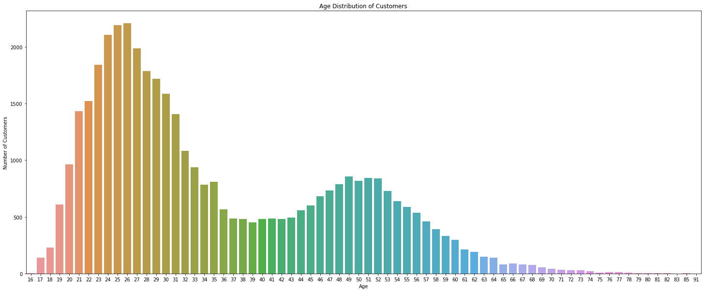
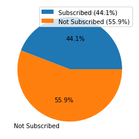
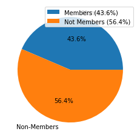
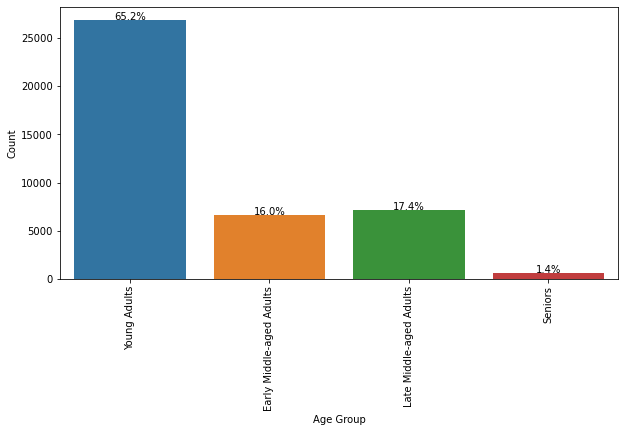

# Recommender System - Andrea Magri, Federico De Marinis, Riccardo Milano

## Introduction
### For our project we have to work as if we are members of the data science team at a prestigious fast fashion firm. Our goal is to increase revenues through the improvement of the recommender system on the online platform. To achieve this, we test different recommendation systems and evaluate their performance in order to select the most suitable one for our platform.

### The datasets available are divide in 3 csv files: Customers, Articles and Transactions
### The Customer csv, contains the ID of each customer together with the age and tells us if the customer is part of the newsletter or the special club member or also both.
### The Articles csv, contains several attributes, each with a "code" and a "name" description. For example, there is the "product_type" attribute that encodes the type of product with a numerical value, while the "product_type_name" attribute provides a textual description of the product type.
### The Transaction csv, consists in a file containing all the purchases of each customer: the date the purchase was made, the ID of the customer and the ID of the product he/she bought. There are some duplicate rows which correspond to multiple purchases of the same item by a single customer.

# EDA and algorithm used
### A recommender system, that can be also identified as an information filtering system, seeks to predict the “preference” a user would have over an item. There are several methods of implementing such systems, including collaborative filtering, content-based filtering and hybrid recommendation. What we are going to develop, are two algorithms, a content-based one and a collaborative.

## EDA
### The very first thing we do before writing the algorithm, is perform an explanatory data analysis for every dataset, starting from customer dataset.
### When performing EDA, a crucial role is played by Null values, so we first check how many nulls there are in the dataset. Given that there are different ways to handle null values, and we don’t want to reduce the sample size and eventually bias the results, we impute missing values with some estimated value, such as using the mean, median or mode of the non-missing values for that feature.  Let’s see age column’s histogram (where null values appear) 

### we see that the histogram of the age column  is not very symmetrical, but neither it has an highly skewed distribution. Furthermore, the missing values are numerical and there are very few of them. In addition, the mean is a good summary statistic that represents the central tendency of the data, and replacing the missing values with the mean can help preserve the statistical properties of the data. So let's proceed and replace the null values with the mean of the non-null values.
### The next step is to categorize customers and we think about 5 different ways to categorize them: 
### 1. by the newsletter subscription status 

### 2. by the club membership status 

### 3. by age group 

### 4. by newsletter subscription status combined with age group categorization 
### 5. by club membership status combined with age group categorization 

### Then we move to the article’s dataset EDA.
### As we did before, we handle null values. In this case, null values are encoded as unknown/-1 and, since there are very few of them (1.03%) we decide to drop the rows containing them. 
### Then we move to article’s categorization and we can do it in different ways. Looking into the dataset, we see that each article belongs to multiple category: the product's type and the product's group.
### The first column is more specific, the second one instead is slightly more generic. 
### Using the product's type and product's group information (categorization) can help the recommendation system understand the context and similarity of the articles, and make more relevant recommendations to the customers. So what we will do is to take into account both categorization, since using only one of these categorizations (e.g., product type) may not provide enough context for the recommendation system to make informed recommendations.
### We compute the number of articles for each product’s type, sorting them in descending order to have a better insight.  
### Then we follow the same process for each product’s group 
### For the sake of completeness, we plot a bar plot for the following columns: department , index group ,  section , garment group . 
### Moving into the colours information, we have many different columns about that and so we have a pretty wide range of options to choose from. 
### A good idea may be to analyse the columns and evaluate which one fits better for our final models. we come up that the perceived colour master column seems to be a middle ground between the other columns, having 18 values’ category, compared to 7 of the perceived colour value  column and the 46 of colour group column. So we visualize the distribution of the colour master dataframe . 

### Now that our analysis on article's dataset is completed, we can move to the last, and probably most important, dataset.
### This dataset is very compact: it has a very small number of columns, indeed it has only the strictly necessary information for the transaction itself, which are the customer's ID, the article's ID and the date when the transaction occurred. It has a very large amount of data stored (369113).
### As usual, the first thing to do is to check if there are any missing values or not.
### We could easily figure that result out: since this dataset is actually a relation between the customer and the article he/she purchased, if one value is null, the transaction can't take place.
### One of the very last step we did in the previous dataset was to delete all articles  which were unknown and undefined. Now what we want is to filter the transaction dataset to only include transactions where the article's ID is present in the updated article dataset. So we can perform an inner join between the transaction dataset and the updated article dataset on the article's ID column. This will only keep rows in the transaction dataset that have a corresponding entry in the cleaned article dataset.
### After this merging, the transaction dataset is reduced by 11578 elements.
### We want to analyze data by grouping the transactions by date and counting the number of transactions. This can be useful for understanding overall customer activity and identifying trends over time. 
### We can see that the distribution of the transaction's date is overall pretty uniform, having a peak in 2020-09-09 with exactly 20600 transactions.
### Then we calculate the number of unique customers and articles involved in the transactions and the number of transaction per customer (on average). 
### It can be extremely useful to compute the number of transaction for each item, since it can give us an idea of which items are the most popular and potentially make good recommendations.
### Then the plot a bar plot for the top 20 article’s names , top 20 article’s types [type!](/ai_img/art_type17.png “Top 20 Article’s Type Bar Plot) and top 20 sections [section!](/ai_img/section18.png “Top 20 Article’s Section Bar Plot).

## Content – based algorithm
### In our case, a content-based recommender system recommends articles to a user based on a comparison of the characteristics of the items. Content-based recommenders are based on the idea that if a person liked an item in the past, they will also like similar items in the future. These systems try to recommend items that are similar to those that a user liked in the past.
### So, the algorithm we are going to implement, uses a similarity measure, more in particular cosine similarity, to determine how closely two items match each other based on their characteristics.
### Since we have quite information about the articles, we have to decide which one to take into consideration when calculating the cosine similarity. 
### What we want to do, is to create a new dataframe where the values in a particular column from “articles”, are stored such that each unique value is represented as a separate binary feature, where a value of 1 indicates that the row (a specific article) has that characteristic and a value of 0 indicates that it does not.
### We create a function that takes as input the dataframe “Articles” and a list of columns from which we want to take all the unique characteristics. The function iteratively merges together the dataframes it creates into a single one and finally returns it. Creating a dataframes that takes into consideration lots of characteristics is important because the more information the algorithm has about an article, the better it will be able to understand the article's content and make recommendations based on that content. However, it is also important not to reduce too much the generalizability of the algorithm because we might deal with overfitting.
### The second function we write is able to return us the most similar articles (together with more or less information about them if we slightly modify it) to the one we input to the function.
### The function identifies from the binary dataframe the row of the article we give as input and calculate the cosine similarity between that article and all the others before finally returning, as we just said, the most recommended ones.

## Collaborative filtering algorithm
### A collaborative recommendation system is a type of recommendation system that makes recommendations to users based on the interactions of multiple users. The idea behind collaborative recommendation systems is that users who have similar tastes or preferences are more likely to enjoy the same items.
### In a user-based collaborative recommendation system, the system compares the ratings of a target user with the ratings of other users to find similar users. It then recommends items that have been highly rated by the similar users, but not necessarily by the target user.
### User-based collaborative recommendation systems rely on the idea of "collaborative filtering": the system filters the recommendations based on the ratings and interactions of multiple users, rather than on the characteristics of the items themselves or the characteristics of the target user.

### To write a code for a collaborative recommendation system, we follow these steps:
### First of all, we create a matrix of users and items, with the ratings or interactions between them.  The rows are the customer_id values and the columns are the article_id values. The aggfunc='count' argument specifies that the values in the matrix should be the number of times the item has been bought by the user.
### For each article that a costumer hasn’t bought, the matrix has null value; for convenience, using the fillna method, we fill any missing values in the matrix with 0.
### Thanks to the apply method we count the number of non-zero values in each row of the matrix (which, once again, represents the number of items that have been bought by each user). These counts are stored in the user_counts variable.
### For computational time problems we select only the rows of the matrix corresponding to users that have rated a sufficient number of items (in this case, 10 or more) using the loc method.
### The np.corrcoef function is used to calculate the similarity matrix of the ratings matrix. This matrix contains the Pearson correlation coefficient between every pair of users in the ratings matrix. The Pearson correlation coefficient is a measure of the linear correlation between two variables. It can range from -1 (perfect negative correlation) to 1 (perfect positive correlation). In the context of a recommendation system, the Pearson correlation coefficient can be used to measure the similarity between two users based on their ratings of items. A positive correlation means that the two users tend to rate items similarly (i.e. they both rate high or low). A negative correlation means that the two users tend to rate items differently (i.e. one rates high and the other rates low). A correlation of 0 means that there is no relationship between the ratings of the two users.
### Then we use the np.argpartitin function to find the k most similar users to a target user (in this case, user 39). This function returns the indices of the k most similar users in the similarity matrix.
### For each item in the ratings matrix, the code checks if the target user has rated the item. If the user has not rated the item, the code predicts a rating for the item by averaging the ratings of the most similar users.
### The code then sorts the predicted ratings in descending order and recommends the items with the highest predicted ratings to the user. Finally, the code prints out a list of the recommended items for the user.

## Conclusion 

### We need to point out a few things.
### Let’s take for instance a man underwear and a hat, both coloured in black. If we consider only the characteristic man/woman and colour, we see that the two articles match and we might think they are similar even tough logically they are two completely different articles.
### If there is not enough data available about the items, it is difficult for the algorithm to make accurate recommendations. But talking about the characteristics, “quantity” is not the only thing we need to look at: the features used to describe the items must be carefully chosen to reflect in the best way the characteristics of the items. Indeed, if the features are poorly defined or do not accurately capture the characteristics of the items, the recommendations made by the algorithm might be not the best. 
### On the other hand, our user-based algorithm is quite reliable. However, if there are not enough users with sufficient ratings to be considered similar to the target user, the algorithm will not be able to select the required number of similar users, and the code will fail. Additionally,since we took in consideration only those users that have rated a sufficient number of items in the ratings matrix, if the target user selected is not in the matrix the code will fail. In conclusion if the dataset is not large enough, the algorithm may not be able to find any similar users or items to recommend, causing the code to fail as well. 
